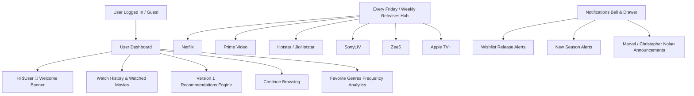

# Implementation Plan - User Dashboard, 6-Platform Weekly Releases, Firebase Watched Schema & Notifications

We will build an interactive **User Dashboard**, a **6-Platform Weekly Releases Hub**, a **Firebase-backed Watched History persistence system**, a **Smart Recommendation Engine (Version 1)**, and a **Notifications System**.

---

## Architecture Overview



---

## Detailed Feature Specifications

### 1. User Dashboard (`/dashboard` & Profile View)
- **Header Greeting**: `Hi $User 👋` (using `user.displayName || 'Movie Buff'`).
- **Dashboard Sections**:
  1. **Watch History & Watched Movies**: Grid of user's watched items with watch date & rating.
  2. **Personalized Recommendations**: Top 20 unwatched movies matched by top genre frequency, sorted by `vote_average`.
  3. **Continue Browsing**: Continue watching carousel.
  4. **Favorite Genres**: Analytics pills showing top watched genres (e.g. 🍿 Action 45%, 🚀 Sci-Fi 30%, 🎭 Drama 25%).

### 2. Firestore Watched Schema
- **Firestore Path**: `users/{uid}/watched/{movieId}`
- **Document Structure**:
  ```json
  {
    "movieId": 1315772,
    "watchedDate": "Timestamp",
    "rating": 8.5,
    "title": "Minions & Monsters",
    "poster_path": "/...",
    "backdrop_path": "/...",
    "media_type": "movie",
    "genre_ids": [12, 16, 35]
  }
  ```
- **Guest Fallback**: `localStorage` under `guest_watched`.

### 3. Weekly Releases Hub ("This Week Releases")
- Platform tabs:
  - **Netflix** (ID: 8)
  - **Prime Video** (ID: 119)
  - **Hotstar / JioHotstar** (ID: 122 / 337)
  - **SonyLIV** (ID: 237 / regional)
  - **Zee5** (ID: 232 / regional)
  - **Apple TV+** (ID: 350)
- Auto-filtered for releases from the current Friday / week (`primary_release_date.gte` & `first_air_date.gte`).

### 4. Notifications System
- Bell icon in top header with unread notification counter badge.
- Interactive notification panel featuring real-time alerts:
  - *"Movie from your wishlist released: Minions & Monsters is now streaming!"*
  - *"New season available: Stranger Things Season 5 premiere!"*
  - *"New Marvel movie on Disney+: Avengers Doomsday added to watch list!"*
  - *"New Christopher Nolan movie announced: Coming to theaters!"*

---

## Proposed File Changes

### 1. Core API & Database Services
- [`MODIFY` `src/api/tmdb.ts`](file:///j:/movie_rated/src/api/tmdb.ts):
  - Add `getWeeklyPlatformReleases(platformId, page)` for Netflix, Prime, Hotstar, SonyLIV, Zee5, and Apple TV+.
  - Add `getPersonalizedRecommendations(topGenreIds, watchedIds)`.
- [`MODIFY` `src/services/userService.ts`](file:///j:/movie_rated/src/services/userService.ts):
  - Update Firestore path to `users/{uid}/watched/{movieId}` storing `watchedDate` & `rating`.
  - Add `addToWatched(userId, media, rating?)`, `removeFromWatched`, `getWatchedHistory`, `subscribeToWatched`.
- [`MODIFY` `src/hooks/useUserLibrary.ts`](file:///j:/movie_rated/src/hooks/useUserLibrary.ts):
  - Expose `watchedList`, `isWatched`, `addWatched`, `removeWatched`, `favoriteGenres`.

### 2. Dashboard & Platform Components
- [`NEW` `src/pages/Dashboard.tsx`](file:///j:/movie_rated/src/pages/Dashboard.tsx):
  - Renders `Hi $User 👋`, Watch History, Recommendations, Continue Browsing, and Favorite Genres.
- [`NEW` `src/components/movies/WeeklyReleasesSection.tsx`](file:///j:/movie_rated/src/components/movies/WeeklyReleasesSection.tsx):
  - "This Week Releases" hub supporting Netflix, Prime Video, Hotstar, SonyLIV, Zee5, Apple TV+.
- [`NEW` `src/components/common/NotificationsModal.tsx`](file:///j:/movie_rated/src/components/common/NotificationsModal.tsx):
  - Dropdown drawer for notifications bell menu.

### 3. Movie Cards & Modal Controls
- [`MODIFY` `src/components/movies/MovieCard.tsx`](file:///j:/movie_rated/src/components/movies/MovieCard.tsx):
  - Add "Watched" checkmark overlay badge.
- [`MODIFY` `src/components/movies/MovieDetailModal.tsx`](file:///j:/movie_rated/src/components/movies/MovieDetailModal.tsx):
  - Add "Mark as Watched" toggle with rating prompt.
- [`MODIFY` `src/pages/Player.tsx`](file:///j:/movie_rated/src/pages/Player.tsx):
  - Auto-record to `users/{uid}/watched/{movieId}` when playback starts.

### 4. Routing & Header Layout
- [`MODIFY` `src/components/Layout.tsx`](file:///j:/movie_rated/src/components/Layout.tsx):
  - Add Notifications Bell button & link to `/dashboard` in User Profile menu.
- [`MODIFY` `src/App.tsx`](file:///j:/movie_rated/src/App.tsx):
  - Add route `<Route path="dashboard" element={<Dashboard />} />`.

---

## Verification Plan

### Automated Verification
- `npx tsc --noEmit` to verify type safety across all components and API signatures.

### Manual Verification
- Test user dashboard greeting `Hi $User 👋` when signed in via Firebase.
- Mark movies as watched and inspect Firestore `users/{uid}/watched/{movieId}` for `watchedDate` & `rating`.
- Verify Version 1 recommendation engine updates based on top watched genres.
- Test "This Week Releases" tab filtering for Netflix, Prime Video, Hotstar, SonyLIV, Zee5, and Apple TV+.
- Test Notifications bell drawer and click interactions.
